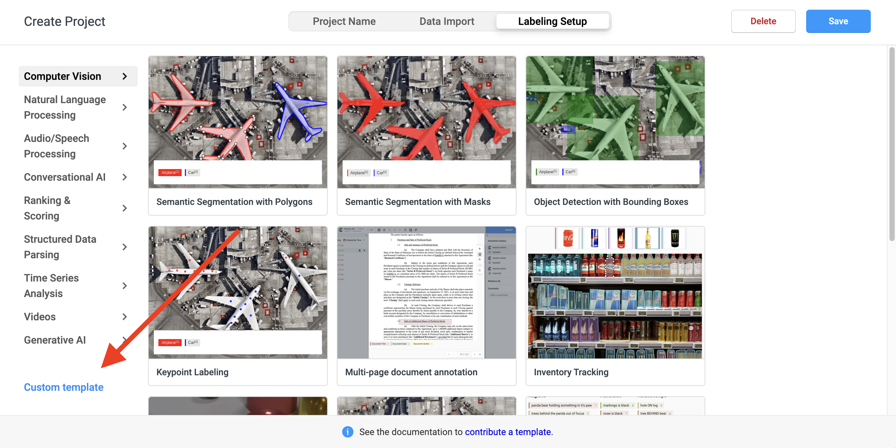

# Caption Label Noise Dataset (CLaN) Documentation - Data Appendix

First we provide an overview of the file contents included in this appendix. Then we  provide details about the data collection and annotation protocol. Then, we provide information on how to setup our annotation interface. Lastly, we show tables and figures showing agreement stratified by question, option, and dataset.

## Documents
1. `veil_annotation_project.zip` : a compressed directory containing images from each in-the-wild dataset. 
2. `annotator_1_labelstudio_export.json` : contains metadata used to populate Label Studio annotation interface and selected annotations from annotator 1.
3. `annotator_1_labelstudio_export.json` : contains metadata used to populate Label Studio annotation interface and selected annotations from annotator 2.
4. `clan-label-interface.xml` : contains labeling interface code which can be pasted into label-studio. Note that the alias (stored in annotations.csv) mapping is in this file.
5. `annotations.csv` : contains all annotations

## Data Collection and Annotation Protocol
 We use three in-the-wild datasets (SBUCaps, RedCaps, Conceptual Captions) to construct this dataset. We perform weighted sampling to draw VAELs from the same distribution as WSOD training; this also represents VAELs from a diverse range of categories rather than a few frequent categroies. We sample 100 VAELs, their caption, and corresponding image from each in-the-wild VL dataset. 

#### Annotation Schema
We annotate four types of information for each sample:
1. (Q1: Label Noise) How much of the VAEL object is present (visible, partially visible, completely absent); 
2. (Q2: Similar Context) If the VAEL object is completely missing, whether a traditionally co-occurring context (“boat” and “water”), or semantically similar object (e.g. “cake” and “bread”, “car” and “truck”) is present; 
3. (Q3: Visual Defects) If visible/partially visible, whether the VAEL object is occluded, has key parts missing, or atypical appearance (e.g. knitted animal); and 
4. (Q4: Linguistic Indicators) What linguistic cues, if any, explain why the VAEL object is mentioned but absent, e.g. the caption discusses events or information beyond what the image shows (“beyond” in Table 1), describes the past (“past”), the extracted label is part of a prepositional phrase and likely to describe the setting and not objects (“on a train”), is a noun modifying another noun, is used in a non-literal way, has a different word sense (e.g. “bed” vs “river bed”), or is part of a named entity.

We compared disagreements between the two annotators after they annotated 100 samples from RedCaps and used it to calibrate responses for the remaining samples from SBUCaps and Conceptual Captions. We indeed observe higher agreement (weighted Cohen's Kappa) for Q2-Q4 the remaining datasets in the Agreement section.


## Annotation Interface Setup
1. Download Label-Studio (requires Python version 3.8+)
````bash
python3 -m venv env
source env/bin/activate
python -m pip install label-studio
````
2. Unzip compressed image data
````bash
unzip veil_annotation_project.zip -d veil_annotation_project
````
3. Setup environment variables
````bash
LABEL_STUDIO_LOCAL_FILES_SERVING_ENABLED=TRUE
LABEL_STUDIO_LOCAL_FILES_DOCUMENT_ROOT=/ # replace with absolute path to the parent directory of veil_annotation_project
````
4. Launch Label Studio `label-studio`
5. Create a new project.


6. Import one of the JSON files above `annotator_1_labelstudio_export.json` OR `annotator_2_labelstudio_export.json`. To populate the labeling interface, copy the contents of `clan-label-interface.xml`.




7. Finally, set the target storage. This is where you want to store your annotations. Note that if you set the environment variables correctly, then all the images should load correctly. (redacted example below)


Should the images not load, then there might be an error with the relative paths in the export file. Check if you can construct the absolute file path by concatenating the output of `echo LABEL_STUDIO_LOCAL_FILES_DOCUMENT_ROOT` and `image_url` in the export json files (after ?d=).

## Annotation Interface Example


## Agreement

|          | Q1     | Q2   | Q3   | Q4     |
|----------|--------|------|------|--------|
| RedCaps | 0.75  | 0.14 |0.29 | 0.56|
| SBUCaps | 0.69  |0.38 |0.49  | 0.57 |
| CC | 0.83 | 0.33 | 0.52 | 0.61 |
_Table: Annotator Agreement with Weighted Cohen's Kappa_

Agreement by Option Figures per Dataset

_Figure: Annotator Agreement for Question 1_


_Figure: Annotator Agreement for Question 2_


_Figure: Annotator Agreement for Question 3_


_Figure: Annotator Agreement for Question 4_
